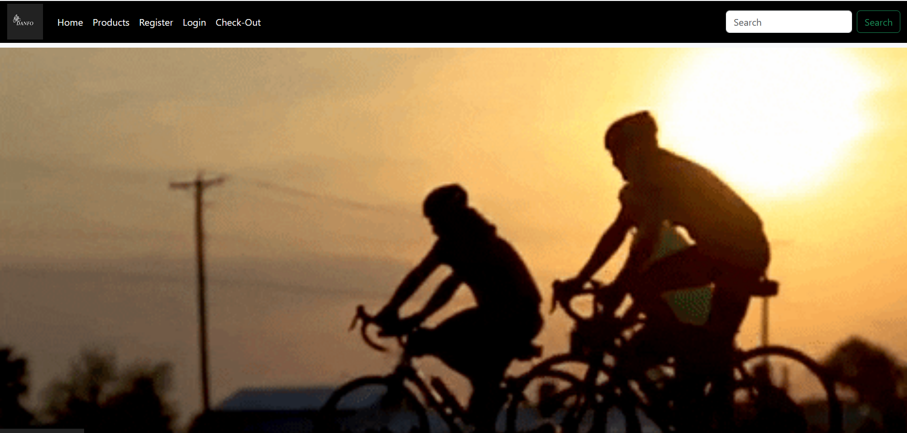
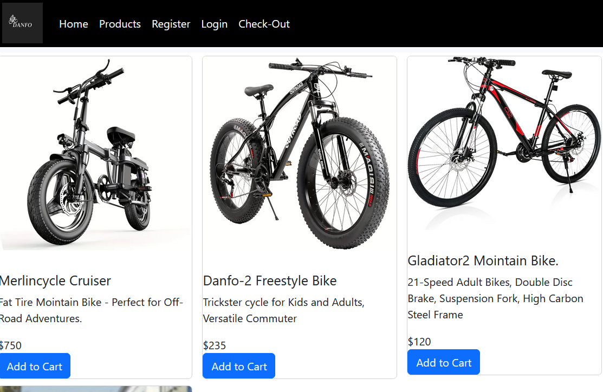
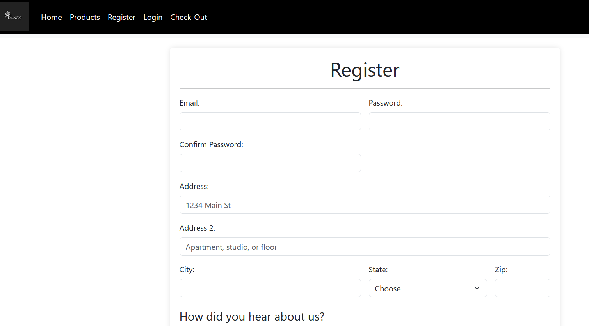
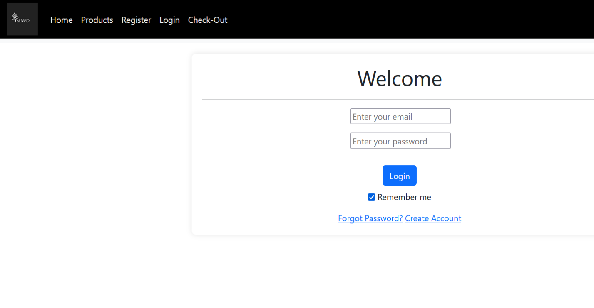
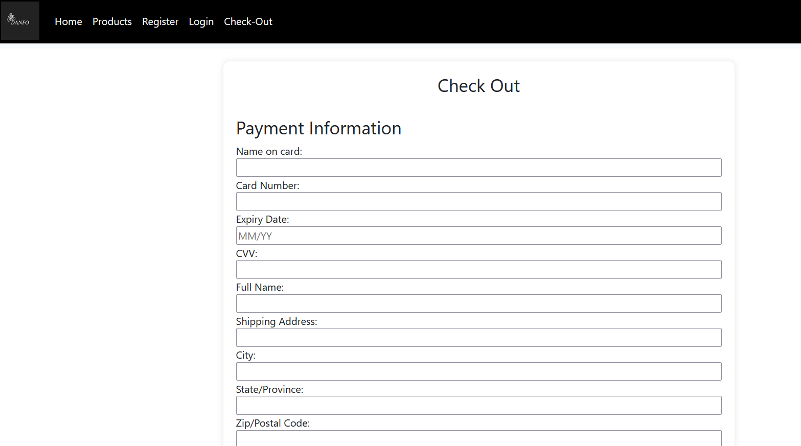
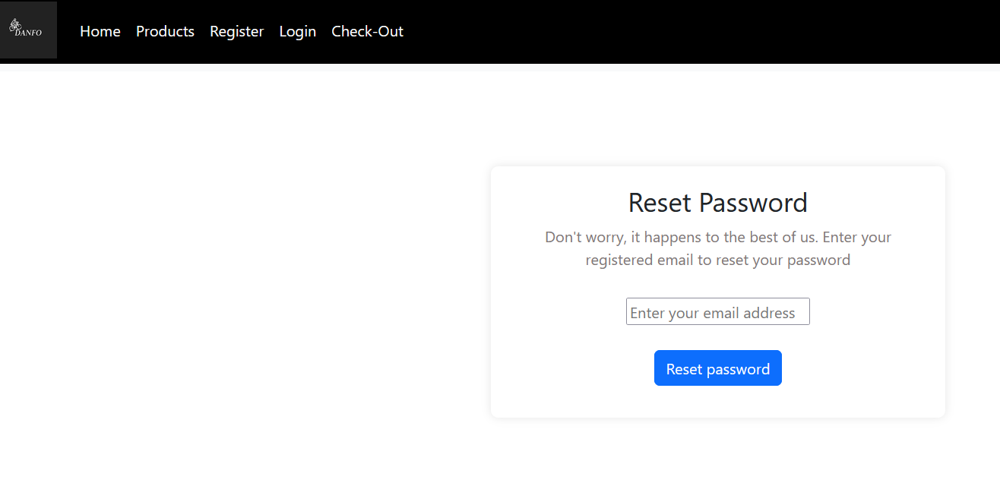

<h2>Bicycle E-Commerce Platform<h2>

<b>Synopsis<b>

This project is a e-commerce platform built primarily for selling bicycles and bicycle accessories. The webpage is designed to allow users to browse through different catalogues of bicycles, view product descriptions, add products to cart, and complete purchase securely. It is a platform includes management system to securely manage customers information.

<b>Features<b>
<ul>
    <li>Navbar: For users to navigate through the platform.</li>
    <li>links: For users to navigate through the platform within pages.</li>
    <li>Search bar: To easily search for desired products.</li>
    <li>Forms: Input for user information.</li>
    <li>Cards: Bootstrap cards to present product for quality.</li>
    <li>Video tags: Used a video tag to add a biking gif to the homepage.</li>
</ul>

<b>Used Technologies<b>
<ul>
    <li>HTML</li>
    <li>CSS</li>
    <li>Bootstrap@5.3.3</li>
    <li>W3C Validator</li>
    <li>W3Schools</li>
</ul>

Screenshots of my platform.

Screenshot of W3C to validate my html

